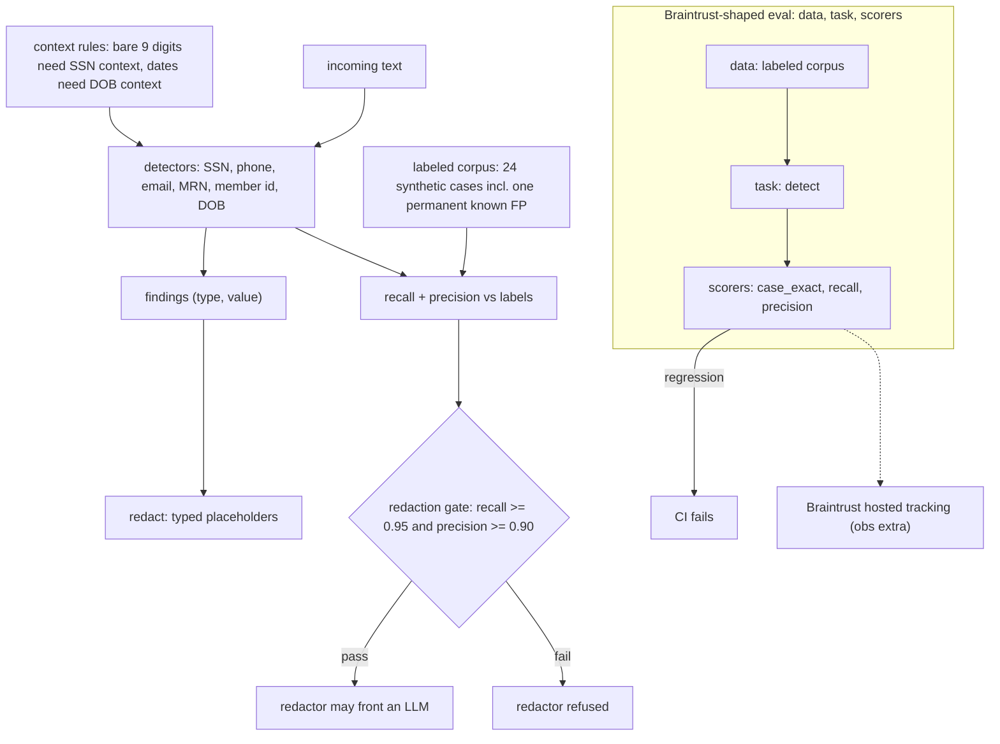

# phi-gate

[](https://github.com/jbisaccia-9/phi-gate/actions) · [captured results](RESULTS.md)

**A PHI-shaped redaction layer that must clear a recall gate before it is
allowed to sit in front of an LLM.**

Regulated-industry LLM pipelines need a scrubbing layer, and most of them trust
it on vibes. This repo treats the redactor like any other component that can
fail: a hand-labeled corpus, recall and precision measured against it, and a
gate — **recall ≥ 0.95, precision ≥ 0.90** — enforced in CI. A redactor that
misses identifiers doesn't get to front an LLM; a redactor that shreds the
document doesn't either.

Part of the *-gate* family:
[kappa-gate](https://github.com/jbisaccia-9/kappa-gate) (LLM-judge calibration) ·
[roi-gate](https://github.com/jbisaccia-9/roi-gate) (ROI conservatism).
Same thesis throughout: nothing ships until it passes a gate.

## Scope, stated honestly

This is the **regex tier**: structured identifiers only — SSNs, phone numbers,
emails, MRNs, member IDs, and keyword-anchored birth dates. Free-text names and
addresses need an NER tier and are explicitly out of scope; a redactor that
overstates its coverage is worse than one that states it. Two context rules
keep precision honest:

- a bare 9-digit number is **not** an SSN without SSN context nearby — invoice
  and order numbers are nine digits too;
- a date is **not** a birth date without DOB context — appointment dates are
  not PHI by themselves.

## Current corpus results

| metric | value | bar |
|---|---|---|
| recall | 1.00 | ≥ 0.95 |
| precision | 0.95 | ≥ 0.90 |

The corpus (24 cases, all synthetic — invalid-range SSNs, 555 phone numbers,
`.test` emails) includes a deliberate limitation case: a supply lot code shaped
exactly like an SSN, which the regex tier cannot distinguish. It is a permanent
known false positive, printed by the gate on every run, and the first item the
NER tier would fix.

## The flow



## Eval structure (Braintrust-shaped)

`python -m phigate suite` runs the `Eval(data, task, scores)` contract
keyless; `case_exact` sits permanently below 1.0 because of the documented
lot-code false positive — the suite pins that honesty as a number. The obs
extra pushes the identical suite to hosted Braintrust.

```
python -m venv .venv
.venv/bin/pip install -U pip
.venv/bin/pip install -e ".[dev]"
.venv/bin/python -m pytest -q
.venv/bin/python -m phigate gate
.venv/bin/python -m phigate redact "Call 480-555-0142 re: MRN 00482913"
```

MIT license.
